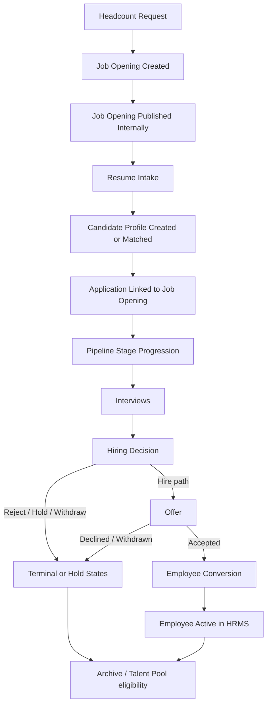
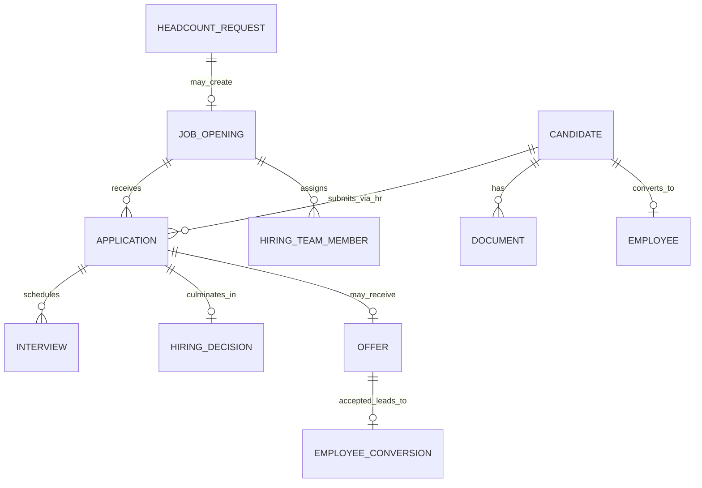
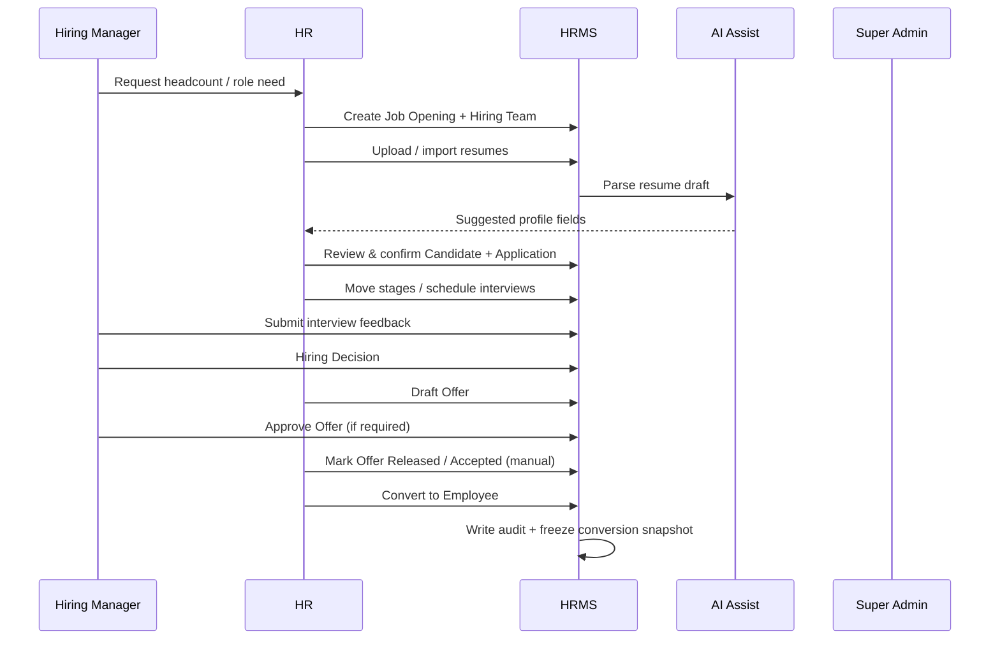
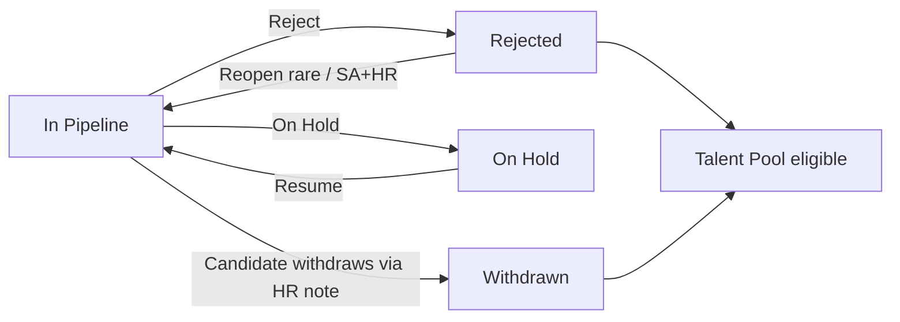
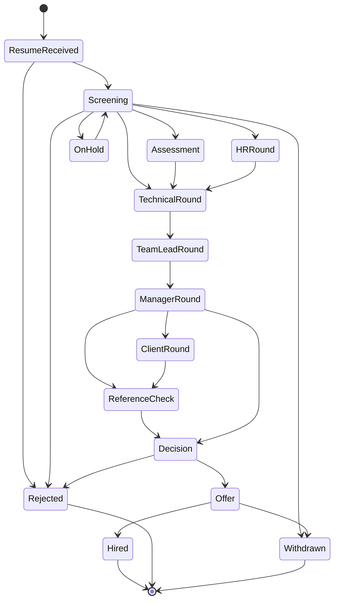
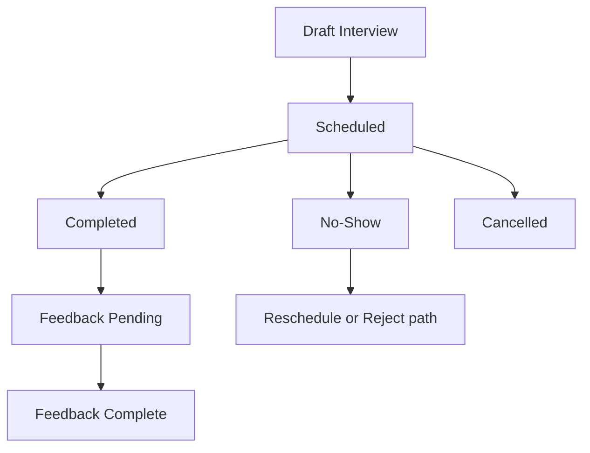
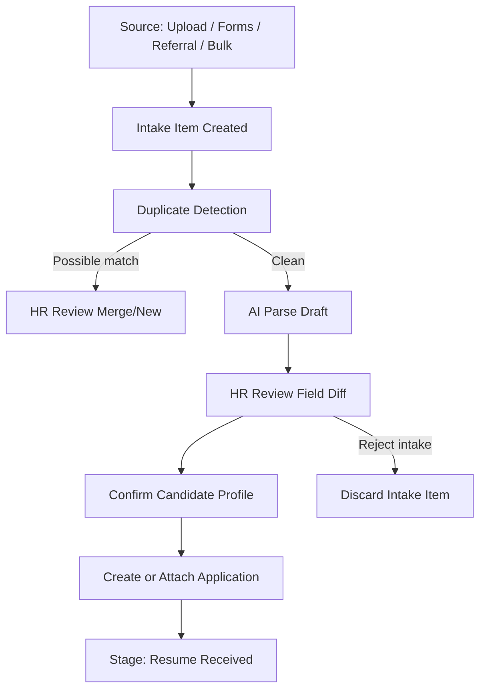
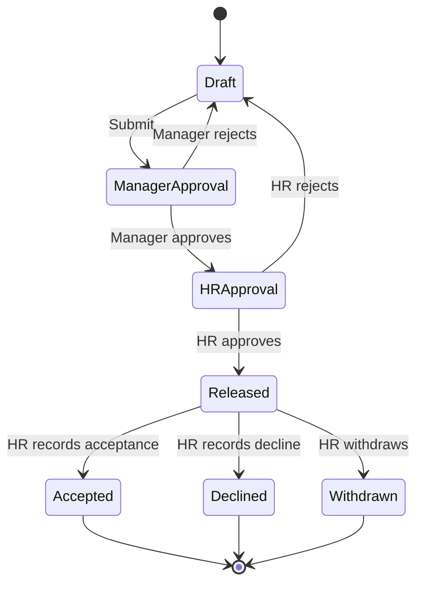

# ZEBL_HRMS — Recruitment Module PRD

| Field | Value |
|-------|-------|
| **Document** | Recruitment Module Product Requirements Document |
| **Status** | Implementation Contract (V1 baseline) |
| **Product** | ZEBL_HRMS (formerly ZEBL_AMS) |
| **Module type** | Internal Hiring Workspace (not an external ATS) |
| **Audience** | Engineering, Product, HR Ops, Security |
| **Depends on** | Existing admin shell, RBAC (3 system roles), Employee hierarchy, audit, notifications |
| **Out of scope (all phases until listed)** | Candidate accounts, public career portal, external ATS sync, automated candidate emailing, e-sign |

---

## Document rules

This PRD is the **implementation contract**. Behavior not specified here is out of scope until a revision is approved.

**Non-negotiable constraints**

1. Recruitment is **internal only**. Candidates have no login.
2. There is **no career portal**, **no external ATS**, **no automated outbound email to candidates**.
3. System roles remain: `super_admin`, `hr`, `employee`. **Hiring Manager** and **Team Lead** are **org-hierarchy capabilities** (via Employee manager/reporting relationships and job-opening hiring-team assignment), not new UserRole values.
4. AI is **assistive only**. AI never rejects, moves stage, overwrites HR-confirmed data, creates employees, approves hiring, or sends communications.
5. **Candidate Workspace** is the primary working surface. Job Opening and Application are supporting workspaces that deep-link into it.
6. Routes live under the existing **admin HR shell** (`/admin/recruitment/*`). No top-level `/recruitment` outside `/admin`.
7. Module must reuse existing design system, FormData + Zod + server-action patterns, audit logging, and notification infrastructure.

---

# 1. Vision

## 1.1 Purpose

Recruitment gives HR and hiring stakeholders a single **Hiring Workspace** to open roles, intake resumes, evaluate candidates, run interviews, decide, offer, and convert hired people into Employees—without leaving ZEBL_HRMS.

It is deliberately **not** a market ATS. It does not market jobs externally or let candidates self-serve. It is an **internal operating system for hiring**.

## 1.2 Business goals

| Goal | Success signal |
|------|----------------|
| Centralize hiring work | All open roles, applications, interviews, offers visible in one module |
| Reduce spreadsheet hiring | Zero parallel “master Excel” for active pipelines (V1 target) |
| Speed decisions | Time-to-decision and time-in-stage measurable |
| Protect integrity | Full audit trail from intake → hire → employee |
| Assist, don’t automate judgment | AI draft/suggest; humans always confirm |
| Clean handoff to workforce | Hired candidate converts to Employee with controlled field mapping |
| Org collaboration | Hiring Manager / Team Lead participate without becoming “recruiter role” |

## 1.3 Users

| Persona | System identity | How they participate |
|---------|-----------------|----------------------|
| **Super Admin** | `super_admin` | Full module access, settings, override, conversion, audit |
| **HR / Recruiter** | `hr` | Primary operator: openings, intake, pipeline, offers, conversion |
| **Hiring Manager** | Usually `employee` with hiring-team assignment on a Job Opening | Reviews pipeline for their jobs, interviews, decisions, offer approval |
| **Team Lead** | Usually `employee` with hiring-team or interview participant role | Interview feedback, notes, limited pipeline visibility for assigned jobs |
| **Candidate** | **Not a user** | Exists only as a Candidate record inside HRMS |

> **Contract:** Do not add a `recruiter` or `hiring_manager` UserRole in V1. Capability is assignment + hierarchy + permission helpers.

## 1.4 Problems solved

- Hiring lives in email threads, shared drives, and Forms with no shared pipeline.
- Resume data is retyped into sheets; duplicates are missed.
- Interview feedback is scattered; decisions lack structured rationale.
- Offer status is opaque; acceptance is tracked informally.
- New joiners are re-entered into Employees with transcription errors.
- No single audit story for “why we hired / rejected.”

## 1.5 Why this module exists

ZEBL_HRMS already owns Employees, attendance, leave, payroll attendance, and helpdesk. Hiring is the **upstream of Employee**. Without Recruitment, the workforce module starts after the most risk-prone process (selection and offer). This module closes that gap as a **first-party Hiring Workspace**, not a bolted-on ATS.

---

# 2. Recruitment Lifecycle

## 2.1 End-to-end flow



## 2.2 Lifecycle stages (domain meaning)

| Step | Owner (primary) | Outcome |
|------|-----------------|---------|
| Headcount Request | Hiring Manager / HR | Approved need for a role (V1 may be lightweight / manual flag on Job Opening) |
| Job Opening | HR | Structured role with hiring team, stages, target dates |
| Resume Intake | HR | Files/forms/referrals enter system |
| Candidate Profile | HR (+ AI assist) | Person record in Talent Pool / Candidate Workspace |
| Application | System + HR | Candidate ↔ Job Opening link with pipeline state |
| Pipeline | HR + Hiring Team | Stage movement with audit |
| Interview | HR schedules; panel scores | Feedback + ratings |
| Hiring Decision | Hiring Manager / HR | Structured recommendation |
| Offer | HR drafts; approvals | Offer lifecycle |
| Employee Conversion | HR / Super Admin | Creates/links Employee; freezes hire snapshot |
| Archive | HR | Closed applications / inactive openings retained for audit & pool |

## 2.3 Entity relationship (conceptual)



## 2.4 Happy path (hire)



## 2.5 Rejection / hold / withdraw paths



---

# 3. Module Navigation

## 3.1 Hierarchy

```
Recruitment                          ← sidebar: Core Workforce → Recruitment
├── Dashboard                        /admin/recruitment
├── Job Openings                     /admin/recruitment/jobs
│   └── Job Opening Workspace        /admin/recruitment/jobs/[id]
├── Candidate Workspace              /admin/recruitment/candidates
│   └── Candidate detail             /admin/recruitment/candidates/[id]
├── Applications                     /admin/recruitment/applications
│   └── Application Workspace        /admin/recruitment/applications/[id]
├── Interviews                       /admin/recruitment/interviews
├── Offers                           /admin/recruitment/offers
├── Talent Pool                      /admin/recruitment/talent-pool
├── Reports                          /admin/recruitment/reports
└── Settings                         /admin/recruitment/settings
```

Sidebar entry (admin only): **Recruitment** under **Core Workforce**, after Employees. Icon: `Briefcase` or `UserPlus`.

## 3.2 Why this hierarchy

| Nav item | Why it exists |
|----------|----------------|
| **Dashboard** | Operational home: today + blockers + funnel |
| **Job Openings** | Role-centric work; hiring teams think in openings |
| **Candidate Workspace** | Person-centric heart; one candidate, many applications |
| **Applications** | Cross-job queue for recruiters (stage, risk, aging) |
| **Interviews** | Calendar-of-record for panels (day-of ops) |
| **Offers** | Comp-sensitive queue with approval states |
| **Talent Pool** | Rejected/withdrawn/future-fit without active application noise |
| **Reports** | Leadership metrics without cluttering ops pages |
| **Settings** | Stage labels, sources, scorecards, AI toggles—not daily work |

## 3.3 Deep-link rules

- From Job Opening Pipeline card → Application Workspace (primary) with Candidate strip link.
- From Application → Candidate Workspace (full person context).
- From Interview → Application + Candidate.
- From Offer → Application + Candidate + Job Opening.
- Conversion success → Employee profile (existing `/admin/employees/[id]`).

## 3.4 Access by persona (nav visibility)

| Nav | Super Admin | HR | Hiring Manager | Team Lead |
|-----|:-----------:|:--:|:--------------:|:---------:|
| Dashboard | Yes | Yes | Scoped | Scoped (light) |
| Job Openings | All | All | Assigned only | Assigned only |
| Candidate Workspace | All | All | Candidates on assigned jobs | Interview-assigned candidates |
| Applications | All | All | Assigned jobs | Limited |
| Interviews | All | All | Own / team | Own |
| Offers | All | All | Assigned jobs (view/approve) | No (unless assigned) |
| Talent Pool | Yes | Yes | No (V1) | No |
| Reports | Yes | Yes | Scoped (V1.5+) | No |
| Settings | Yes | Limited | No | No |

---

# 4. Recruitment Dashboard

**Route:** `/admin/recruitment`  
**Primary users:** HR, Super Admin; scoped widgets for Hiring Manager.

## 4.1 Widget catalog

### 4.1.1 Hiring Funnel

| Attribute | Spec |
|-----------|------|
| **Purpose** | Show volume by pipeline stage across open applications (filterable by job / date). |
| **Display** | Horizontal/vertical stage bars or stepped funnel; counts + % conversion between stages. |
| **Actions** | Filter by Job Opening, date range, recruiter; toggle “open jobs only”. |
| **Click** | Click stage → Applications list pre-filtered to that stage. |
| **Permissions** | HR/SA: org-wide. HM: assigned openings only. |

### 4.1.2 Today’s Interviews

| Attribute | Spec |
|-----------|------|
| **Purpose** | Day-of interview operations. |
| **Display** | Time-sorted list: candidate, job, stage, panel, status (scheduled/completed/no-show). |
| **Actions** | Mark complete (shortcut), open feedback form. |
| **Click** | Row → Interview Workspace. |
| **Permissions** | HR/SA all; HM/TL own/participating. |

### 4.1.3 Open Jobs

| Attribute | Spec |
|-----------|------|
| **Purpose** | Active openings at a glance. |
| **Display** | Cards/rows: title, dept, openings count, apps in pipeline, days open, owner. |
| **Actions** | Create Job Opening (HR/SA). |
| **Click** | → Job Opening Workspace Overview. |
| **Permissions** | Create: HR/SA. View: as nav matrix. |

### 4.1.4 Pending Decisions

| Attribute | Spec |
|-----------|------|
| **Purpose** | Applications waiting on Hiring Decision past SLA or explicitly flagged. |
| **Display** | Candidate, job, days in Decision stage, assigned manager. |
| **Actions** | Nudge (in-app notification), open decision form. |
| **Click** | → Application → Hiring Decision section / Candidate Decision tab. |
| **Permissions** | HR/SA all; HM own assignments. |

### 4.1.5 Recent Activity

| Attribute | Spec |
|-----------|------|
| **Purpose** | Activity feed of recruitment events (stage moves, uploads, decisions). |
| **Display** | Timeline list (last 20–50), actor + object + time. |
| **Actions** | None beyond navigation. |
| **Click** | Entity deep-link. |
| **Permissions** | Scoped to visible entities. |

### 4.1.6 Quick Actions

| Attribute | Spec |
|-----------|------|
| **Purpose** | Reduce clicks for HR daily ops. |
| **Display** | Buttons: Upload Resume, New Job Opening, Import, Schedule Interview, New Offer draft. |
| **Actions** | Opens Dialog/Sheet flows. |
| **Click** | Action-specific modal or route. |
| **Permissions** | Buttons gated individually (HR/SA primary). |

### 4.1.7 AI Queue

| Attribute | Spec |
|-----------|------|
| **Purpose** | Human review queue for AI outputs awaiting confirmation. |
| **Display** | Items: resume parse pending review, duplicate suggestions, profile completion drafts. |
| **Actions** | Review / Accept / Dismiss. |
| **Click** | → Review surface on Candidate or Intake item. |
| **Permissions** | HR/SA only. AI never auto-applies. |

### 4.1.8 Recent Candidates

| Attribute | Spec |
|-----------|------|
| **Purpose** | Newly created/updated candidates. |
| **Display** | Name, source, created at, open applications count. |
| **Click** | → Candidate Workspace. |
| **Permissions** | HR/SA; HM if overlapping assigned jobs. |

### 4.1.9 Recent Offers

| Attribute | Spec |
|-----------|------|
| **Purpose** | Offer pipeline health. |
| **Display** | Candidate, job, offer status, pending approver. |
| **Click** | → Offer detail / Application Offer section. |
| **Permissions** | HR/SA; HM for assigned jobs. |

### 4.1.10 Pipeline Velocity

| Attribute | Spec |
|-----------|------|
| **Purpose** | Median/average days in stage (org or job filter). |
| **Display** | Compact metric + spark/bar by stage. |
| **Click** | → Reports → Time in Stage. |
| **Permissions** | HR/SA; HM scoped (optional V1). |

## 4.2 Dashboard layout contract

1. Header: `WorkspacePageHeader` — title “Recruitment”, description, primary CTA “New Job Opening”.
2. KPI row: Open Jobs, Active Applications, Interviews Today, Pending Decisions (DashboardCards).
3. Main: Funnel + Today’s Interviews.
4. Rail: Quick Actions, AI Queue, Recent Activity.
5. Secondary: Recent Candidates, Recent Offers, Pipeline Velocity.

Empty states required for every widget when count = 0.

---

# 5. Job Opening Workspace

**Route:** `/admin/recruitment/jobs/[id]`  
**Center of role-centric work.** Tabs below are mandatory for V1 unless marked roadmap.

## 5.1 Overview

| | |
|--|--|
| **Purpose** | Role definition and hiring status at a glance. |
| **Display** | Title, department, location/mode, employment type, openings (headcount), status (Draft/Open/On Hold/Closed/Filled), target start, recruiter owner, hiring manager, compensation band (permission-gated), description, requirements. |
| **Actions** | Edit opening, change status, clone opening, close/fill. |
| **Permissions** | Edit: HR/SA. HM: view + limited fields (notes, urgency). Comp band: HR/SA (+ HM view if policy allows). |
| **Future** | Headcount request linkage, approval workflow for opening publish. |

## 5.2 Pipeline

| | |
|--|--|
| **Purpose** | Kanban/board or column list of applications by stage for this job. |
| **Display** | Columns = configured stages; cards = candidate name, days in stage, priority, score, risk flags. |
| **Actions** | Move stage (with confirmation), open application, assign recruiter, set priority. |
| **Permissions** | Move: HR/SA; HM may move within allowed stage set (configurable). TL: view + feedback only (V1 no drag). |
| **Future** | Drag-and-drop kanban, WIP limits, SLA badges. |

## 5.3 Applications

| | |
|--|--|
| **Purpose** | Tabular list for power users (sort/filter). |
| **Display** | DataTable: candidate, stage, source, applied/created date, recruiter, score, decision, offer status. |
| **Actions** | Bulk stage change (HR), export (V1.5), open rows. |
| **Permissions** | Same visibility as Pipeline. Bulk: HR/SA. |
| **Future** | Saved views, CSV export. |

## 5.4 Hiring Team

| | |
|--|--|
| **Purpose** | Define who can see and act on this opening. |
| **Display** | Members with role on job: Recruiter (HR user), Hiring Manager, Team Lead(s), Interviewers. |
| **Actions** | Add/remove member, set job-role, set notification prefs for job. |
| **Permissions** | Manage team: HR/SA. |
| **Future** | Template teams by department. |

## 5.5 Timeline

| | |
|--|--|
| **Purpose** | Job-level history. |
| **Display** | Chronological events (created, published, stage config changed, status changes, hire filled). |
| **Actions** | Filter by event type. |
| **Permissions** | View if can view job. |
| **Future** | Comment-on-event. |

## 5.6 Documents

| | |
|--|--|
| **Purpose** | JD, scorecards, rubrics, approval docs. |
| **Display** | File list with type tags. |
| **Actions** | Upload, rename, delete (soft), download. |
| **Permissions** | Upload/delete: HR/SA. View: hiring team. |
| **Future** | Versioning. |

## 5.7 Notes

| | |
|--|--|
| **Purpose** | Internal collaboration on the role (not candidate-specific). |
| **Display** | Note thread with visibility (team / HR-only). |
| **Actions** | Add, pin, resolve, mention. |
| **Permissions** | Per note visibility rules (§10). |
| **Future** | Note templates. |

## 5.8 Analytics

| | |
|--|--|
| **Purpose** | Per-job funnel and velocity. |
| **Display** | Stage conversion, time in stage, source mix, interview count. |
| **Actions** | Date filter. |
| **Permissions** | HR/SA; HM view for own jobs. |
| **Future / Roadmap** | Richer charts V1.5+. |

## 5.9 Audit

| | |
|--|--|
| **Purpose** | Immutable security/compliance log for this opening. |
| **Display** | Actor, action, before/after summary, timestamp, IP/session if available from platform audit. |
| **Actions** | Filter only. |
| **Permissions** | HR (read), SA (read). No edit/delete. |
| **Future** | Export audit slice. |

---

# 6. Candidate Workspace

**This is the heart of Recruitment.**  
**Route:** `/admin/recruitment/candidates/[id]`

One Candidate may have many Applications. The workspace is **person-centric**. Application-specific pipeline controls also appear in Application Workspace and are mirrored/summary here.

## 6.1 Overview

| Attribute | Spec |
|-----------|------|
| **Purpose** | Identity + status snapshot. |
| **Display** | Full name, preferred name, email, phone, location, current company/title, source, tags, overall status (Active in pipeline / Hired / In pool / Do-not-hire), open applications count, primary recruiter. |
| **Actions** | Edit identity fields, merge duplicate (HR/SA), add tag, mark Do-not-hire (SA/HR with reason). |
| **Permissions** | Edit: HR/SA. HM/TL: view fields relevant to assigned applications. |
| **Relationships** | Links to Applications, Documents, Employee (if converted). |
| **Future** | Social links, referral employee link. |

## 6.2 Resume

| Attribute | Spec |
|-----------|------|
| **Purpose** | Canonical resume artifact(s). |
| **Display** | Latest resume preview (PDF/DOC metadata + viewer if feasible), version history list, parse status. |
| **Actions** | Upload new version, set primary, trigger AI parse (creates draft, not auto-write), download. |
| **Permissions** | Upload/parse: HR/SA. View: hiring team on related apps. |
| **Relationships** | Feeds Experience/Education/Skills drafts via AI. |
| **Future** | Side-by-side version diff. |

## 6.3 Applications

| Attribute | Spec |
|-----------|------|
| **Purpose** | All job applications for this person. |
| **Display** | List: job title, stage, priority, recruiter, created date, decision/offer badges. |
| **Actions** | Create application to another open job, open Application Workspace. |
| **Permissions** | Create app: HR/SA. |
| **Relationships** | Application is the pipeline unit. |
| **Future** | Cross-job comparison view. |

## 6.4 Experience

| Attribute | Spec |
|-----------|------|
| **Purpose** | Structured work history. |
| **Display** | Roles: company, title, start/end, description, current flag. |
| **Actions** | Add/edit/reorder; Accept AI suggestions field-by-field. |
| **Permissions** | HR/SA edit. Others view. |
| **Relationships** | Sourced from resume parse drafts. |
| **Future** | Employment verification status. |

## 6.5 Education

| Attribute | Spec |
|-----------|------|
| **Purpose** | Degrees and institutions. |
| **Display** | Institution, degree, field, year. |
| **Actions** | CRUD; accept AI drafts. |
| **Permissions** | HR/SA edit. |
| **Future** | Credential verification. |

## 6.6 Skills

| Attribute | Spec |
|-----------|------|
| **Purpose** | Skill tags with optional proficiency. |
| **Display** | Chip list; inferred vs confirmed badges. |
| **Actions** | Add/remove; confirm AI-inferred skills. |
| **Permissions** | HR/SA; HM may suggest (note) in V1.5. |
| **Future** | Skill ontology, job-skill match %. |

## 6.7 Projects

| Attribute | Spec |
|-----------|------|
| **Purpose** | Notable projects from resume/profile. |
| **Display** | Title, summary, tech, links. |
| **Actions** | CRUD; accept AI drafts. |
| **Permissions** | HR/SA. |
| **Future** | Portfolio attachments. |

## 6.8 Certifications

| Attribute | Spec |
|-----------|------|
| **Purpose** | Licenses/certs. |
| **Display** | Name, issuer, date, expiry. |
| **Actions** | CRUD. |
| **Permissions** | HR/SA. |
| **Future** | Expiry alerts. |

## 6.9 Compensation

| Attribute | Spec |
|-----------|------|
| **Purpose** | Sensitive pay expectations and history of discussions. |
| **Display** | Current CTC, expected CTC, currency, notice period, negotiable flag, notes. **Masked** for unauthorized roles. |
| **Actions** | Edit (HR/SA); view for HM if job policy allows. |
| **Permissions** | Strict: default HR/SA only; HM opt-in per settings. TL: never (V1). |
| **Relationships** | Feeds Offer draft defaults. |
| **Future** | Band fit indicator vs job opening band. |

## 6.10 Availability

| Attribute | Spec |
|-----------|------|
| **Purpose** | Scheduling and join constraints. |
| **Display** | Notice period, earliest join date, interview availability notes, time zone. |
| **Actions** | Edit. |
| **Permissions** | HR/SA; HM view. |
| **Future** | Calendar busy import (internal only). |

## 6.11 Documents

| Attribute | Spec |
|-----------|------|
| **Purpose** | All candidate files (resume versions, assessments, ID placeholders, offer PDFs). |
| **Display** | Typed document list. |
| **Actions** | Upload, classify type, delete soft, download. |
| **Permissions** | By document classification (offer/comp docs HR/SA only). |
| **Future** | Virus scan status display. |

## 6.12 Timeline

| Attribute | Spec |
|-----------|------|
| **Purpose** | Person-level chronological truth. |
| **Display** | Unified events across applications, interviews, notes, AI reviews, offers, conversion. |
| **Actions** | Filter by type/application. |
| **Permissions** | View if can view candidate. |
| **Future** | Export timeline. |

## 6.13 Notes

| Attribute | Spec |
|-----------|------|
| **Purpose** | Durable observations (structured collaboration). |
| **Display** | List with author, visibility, pin/resolved state. |
| **Actions** | Create, edit own, pin, resolve, @mention. |
| **Permissions** | See §10. |
| **Future** | Note templates per stage. |

## 6.14 Internal Chat

| Attribute | Spec |
|-----------|------|
| **Purpose** | Fast back-and-forth among hiring team on this candidate. |
| **Display** | Thread UI (internal only). Not visible to candidates (no candidate users). |
| **Actions** | Post message, mention, attach file, pin message. |
| **Permissions** | Hiring team for related open applications + HR/SA. |
| **Relationships** | Important messages can be “promote to Note”. |
| **Future** | Read receipts. |

## 6.15 Interviews

| Attribute | Spec |
|-----------|------|
| **Purpose** | All interviews across applications. |
| **Display** | Table/cards: job, round, date, panel, status, avg rating. |
| **Actions** | Schedule (HR), open Interview Workspace, add feedback if participant. |
| **Permissions** | Schedule: HR/SA. Feedback: participants + HR/SA. |
| **Future** | Scorecard templates per round. |

## 6.16 AI Insights

| Attribute | Spec |
|-----------|------|
| **Purpose** | Assistive panel: summary, quality score, match vs selected job, duplicate alerts, gaps. |
| **Display** | Cards with **confidence**, generated-at, “Draft — not confirmed” labeling. |
| **Actions** | Regenerate, Accept suggestion (field-level), Dismiss. **No stage/decision actions.** |
| **Permissions** | HR/SA primary; HM view summaries for assigned jobs. |
| **Limitations** | Never authoritative; never auto-writes without Accept. |
| **Future** | Semantic search across pool (V2). |

## 6.17 Hiring Decision

| Attribute | Spec |
|-----------|------|
| **Purpose** | Structured decision per selected Application (selector if multiple). |
| **Display** | Decision enum, rationale, strengths, concerns, salary recommendation, risk, history. |
| **Actions** | Submit / revise decision (versioned history). |
| **Permissions** | Submit: Hiring Manager (assigned) + HR/SA. TL: recommend via feedback only unless granted. |
| **Relationships** | Gates Offer creation (policy: require decision ≥ Hire). |
| **Future** | Multi-approver decision committee. |

## 6.18 Offer

| Attribute | Spec |
|-----------|------|
| **Purpose** | Offer status for the selected application. |
| **Display** | Current offer state machine, package summary (gated), approval trail. |
| **Actions** | Create draft, submit approvals, mark released/accepted/declined/withdrawn (manual). |
| **Permissions** | See §14. |
| **Future** | E-sign (V3). |

## 6.19 Audit

| Attribute | Spec |
|-----------|------|
| **Purpose** | Compliance log for candidate record. |
| **Display** | Immutable events. |
| **Actions** | Filter. |
| **Permissions** | HR/SA. |
| **Future** | Legal hold flag. |

---

# 7. Application Workspace

**Route:** `/admin/recruitment/applications/[id]`  
**Pipeline unit of work** linking one Candidate to one Job Opening.

## 7.1 Core fields

| Field | Spec |
|-------|------|
| **Status** | Derived primarily from pipeline stage + terminal flags (Active, Hired, Rejected, On Hold, Withdrawn). |
| **Priority** | Enum: Low / Normal / High / Critical. Set by HR; visible to hiring team. |
| **Pipeline** | Reference to job’s stage set; current position. |
| **Current stage** | Exact stage id/name; entered-at timestamp; days-in-stage computed. |
| **History** | Ordered stage transitions with actor, from→to, note, timestamp. |
| **Assigned recruiter** | HR user responsible. |
| **Assigned manager** | Hiring Manager for this application (defaults from Job Opening). |
| **Risk** | Flags: stale SLA, missing feedback, duplicate suspect, incomplete profile, compensation mismatch, do-not-hire on candidate. |
| **Score** | Aggregate interview/scorecard score (nullable until interviews exist); optional manual HR score. |
| **Timeline** | Application-scoped event stream (subset of candidate timeline). |

## 7.2 Layout contract

1. Header: Candidate name + Job title + stage badge + priority.
2. Actions: Move stage, Schedule interview, Open candidate, Record decision, Create offer.
3. Body: Stage history, assignments, risk/score, recent interviews, notes strip.
4. Side: Quick links to Resume, Compensation (gated), AI match vs this job.

## 7.3 Rules

- Creating an Application requires existing Candidate + Open Job Opening.
- Moving to **Offer** stage requires Hiring Decision in {Strong Hire, Hire} unless Super Admin override (audited).
- Moving to **Hired** requires Offer Accepted (or SA override with reason).
- Rejected / Withdrawn / Hired are terminal for that application (reopen = audited exception).

---

# 8. Pipeline

## 8.1 Default stages (system defaults)

Order below is the **default template**. Jobs may disable optional stages but may not invent unknown stages in V1 without Settings admin.

| # | Stage | Required? | Purpose |
|---|-------|-----------|---------|
| 1 | Resume Received | Yes | Intake landed; awaiting screen |
| 2 | Screening | Yes | HR screen |
| 3 | Assessment | Optional | Tests/assignments |
| 4 | HR Round | Optional | HR interview |
| 5 | Technical Round | Optional | Technical interview |
| 6 | Team Lead Round | Optional | TL interview |
| 7 | Manager Round | Yes* | Hiring Manager interview (*required if HM assigned) |
| 8 | Client Round | Optional | External client interview (internal logging only) |
| 9 | Reference Check | Optional | References |
| 10 | Decision | Yes | Formal hiring decision |
| 11 | Offer | Yes | Offer lifecycle |
| 12 | Hired | Terminal success | Converted / ready to convert |
| — | Rejected | Terminal | Not selected |
| — | On Hold | Non-terminal hold | Paused |
| — | Withdrawn | Terminal | Candidate withdrew (via HR) |

## 8.2 Stage contracts

### Resume Received

| | |
|--|--|
| **Entry** | Application created from intake/upload/referral/import. |
| **Exit** | Move to Screening (or Reject/Withdraw/Hold). |
| **Allowed actions** | Attach resume, AI parse review, assign recruiter, reject. |
| **Permissions** | HR/SA move; HM view. |

### Screening

| | |
|--|--|
| **Entry** | From Resume Received. |
| **Exit** | Assessment / HR Round / Technical / Reject / Hold / Withdraw. |
| **Allowed actions** | Screen notes, schedule first interview, reject. |
| **Permissions** | HR/SA; HM comment. |

### Assessment

| | |
|--|--|
| **Entry** | From Screening (or HR). |
| **Exit** | Next interview stage / Reject / Hold. |
| **Allowed actions** | Upload assessment, score, due date. |
| **Permissions** | HR/SA manage; HM view scores. |

### HR Round / Technical / Team Lead / Manager / Client Round

| | |
|--|--|
| **Entry** | Prior stage completion or HR skip (audited). |
| **Exit** | Next configured round / Decision / Reject / Hold. |
| **Allowed actions** | Schedule interview of matching type, collect feedback, move when feedback policy met. |
| **Permissions** | Move: HR/SA (HM may move after own round if configured). Feedback: panel. |

### Reference Check

| | |
|--|--|
| **Entry** | Typically post-Manager / pre-Decision. |
| **Exit** | Decision / Reject / Hold. |
| **Allowed actions** | Log reference outcomes (internal notes). |
| **Permissions** | HR/SA. |

### Decision

| | |
|--|--|
| **Entry** | Interviews complete per job policy (or HR force with reason). |
| **Exit** | Offer (if hire) / Rejected / On Hold / Withdrawn. |
| **Allowed actions** | Submit Hiring Decision (§13). |
| **Permissions** | HM + HR/SA. |

### Offer

| | |
|--|--|
| **Entry** | Decision Strong Hire / Hire (+ policy checks). |
| **Exit** | Hired (accepted) / Rejected path rare / Withdrawn / back to Decision on decline (policy). |
| **Allowed actions** | Offer state machine (§14). |
| **Permissions** | HR/SA operate; HM approve. |

### Hired

| | |
|--|--|
| **Entry** | Offer Accepted (or SA override). |
| **Exit** | None (terminal). Conversion may occur here or immediately after. |
| **Allowed actions** | Convert to Employee, view snapshot. |
| **Permissions** | Convert: HR/SA. |

### Rejected / On Hold / Withdrawn

| Stage | Entry | Exit | Actions | Permissions |
|-------|-------|------|---------|-------------|
| Rejected | Explicit reject action + reason code | Reopen only via HR/SA audited | Reason, talent-pool flag | HR/SA |
| On Hold | Hold + reason | Resume to previous or Screening | Reason, remind date | HR/SA; HM request hold |
| Withdrawn | HR records candidate withdrawal | Reopen rare | Reason | HR/SA |

## 8.3 Movement rules (global)

1. Every move writes timeline + audit.
2. Optional “require note on skip/backward move.”
3. AI cannot move stages.
4. Bulk moves limited to HR/SA; same-stage target; max batch size policy.



---

# 9. Interview Workspace

**Route:** `/admin/recruitment/interviews/[id]` (and list at `/interviews`)

## 9.1 Fields & areas

| Area | Spec |
|------|------|
| **Schedule** | Start/end, timezone, duration, round type (maps to pipeline stage), location (onsite/virtual). |
| **Participants** | Interviewers (employees), optional observer; candidate is display-only identity (no account). |
| **Meeting links** | Manual URL fields (Meet/Teams/Zoom). **No auto-email** of links to candidate in V1—HR copies externally if needed. |
| **Transcripts** | Optional paste/upload text; AI may summarize if present. |
| **Recordings** | Link or file reference; access restricted to hiring team + HR/SA. |
| **Feedback** | Per-interviewer structured scorecard: ratings dimensions, recommendation, free text. |
| **Attachments** | Round-specific files. |
| **Ratings** | Dimension scores + overall; aggregation visible on Application. |
| **Summary** | Human summary + optional AI draft summary (Accept to pin). |
| **Timeline** | Scheduled, rescheduled, completed, no-show, feedback submitted. |

## 9.2 Workflows



## 9.3 Rules

- At least one interviewer required to schedule.
- Feedback is private to hiring team; not editable after lock window except HR/SA.
- AI Interview Summary is draft until accepted.
- Completing feedback does **not** auto-advance stage.

---

# 10. Internal Collaboration

## 10.1 Notes

| Type | Visibility | Use |
|------|------------|-----|
| Team note | Hiring team on related job(s) | Default collaboration |
| Private note | Author + HR/SA | Sensitive observations |
| HR-only note | `hr` + `super_admin` | Comp, background, legal |
| Pinned note | Same as underlying visibility | Sticky at top of Candidate/Job |
| Resolved note | Visible but collapsed | Decision closed-out |

**Workflow:** Create → optional @mention → notify mentioned users → pin/resolve.

## 10.2 Internal Chat

- Real-time-ish thread on Candidate (V1 may be request/response refresh).
- Mentions create notifications.
- “Promote to Note” copies content into Notes with attribution.
- Chat is not a substitute for Hiring Decision (cannot replace structured decision).

## 10.3 Mentions

- `@Name` resolves to Employees/Users with recruitment access.
- Invalid mentions rejected.
- Mention in Note or Chat → in-app notification.

## 10.4 Timeline

Collaboration events appear on Candidate/Job timelines: note added, chat promoted, mention, pin, resolve.

## 10.5 Notifications (collaboration subset)

See §18 for full list. Collaboration triggers: Mentioned, Note Assigned/Pinned (optional), Chat mention.

## 10.6 Rules

- No candidate-facing channel exists.
- Deleting notes is soft-delete; SA may hard-hide for legal; always audited.
- Private notes never appear in HM export (V1.5 reports).

---

# 11. Resume Intake

## 11.1 Channels

| Channel | V1 | Description |
|---------|----|-------------|
| Manual upload | Yes | HR uploads file(s) to intake or directly to Candidate |
| Referral upload | Yes | HR creates candidate with source=Referral + referring employee |
| Bulk import | Yes | Multi-file upload or CSV+files package; queue processing |
| Google Forms intake | Yes* | Ingest responses + optional resume link/file via integration/import job (*connector may be V1.5 if OAuth not ready; V1 supports CSV export import from Forms) |
| AI parse | Yes | Post-upload assistive parse |
| Email intake | No | Explicitly out of scope |

## 11.2 Intake pipeline



## 11.3 Duplicate detection

- Match signals: email (strong), phone (strong), name+company (weak).
- Output: possible matches with confidence; **HR must choose** Merge / Create New / Link to Existing.
- AI may suggest; AI may not merge.

## 11.4 Review & approval

- Parse results are **drafts**.
- HR Accept applies field updates; Reject discards draft.
- Partial accept allowed (per-section).

## 11.5 Timeline

Intake item events: received, parse started/finished, duplicate flagged, merged, application created, discarded.

---

# 12. AI Features

**Global AI policy:** Assistive. Human confirmation required for any write to confirmed HR data. AI never: rejects, moves stage, overwrites without Accept, creates Employee, approves hiring, sends communications.

| Feature | Purpose | Input | Output | Approval | Confidence | Limitations |
|---------|---------|-------|--------|----------|------------|-------------|
| **Resume Parsing** | Extract structured profile | Resume file/text | Draft Experience/Education/Skills/Projects/Certs/Contact | Field/section Accept | Per-field score | OCR/layout errors; languages; never auto-save |
| **Profile Completion** | Suggest missing fields | Partial profile + resume | Suggested fills | Accept/Dismiss | Overall + per field | Must not invent employers |
| **Quality Score** | Resume completeness/clarity assist | Resume + profile | 0–100 + reasons | Display only unless HR pins | Model confidence | Not a hire recommendation |
| **Candidate Summary** | Short briefing for panel | Profile + apps + notes (non-private) | Paragraph summary draft | Accept to pin on Overview | Confidence + freshness | Excludes private/HR-only notes |
| **Duplicate Detection** | Prevent duplicate people | New intake vs pool | Match list + scores | HR merge decision | Match confidence | False positives on common names |
| **Job Match** | Fit vs Job Opening | Candidate + JD/requirements | Match % + skill gaps + strengths | Display; optional pin | Confidence | Not a decision; bias risk—show disclaimer |
| **Interview Summary** | Condense feedback/transcript | Feedback + transcript | Summary draft | Accept to pin on Interview | Confidence | Hallucination risk—require human read |
| **Decision Draft** | Draft rationale scaffolding | Feedback + notes + scores | Draft strengths/concerns/rationale | HM/HR edit then submit as **their** decision | Confidence | Never auto-submits decision |
| **Semantic Search** | Find similar talent | Query + pool embeddings | Ranked candidates | N/A (retrieval) | Retrieval score | **V2+** |

### AI Queue

All write-capable AI outputs appear in Dashboard AI Queue until Accepted or Dismissed.

### Audit

Every AI generation and Accept/Dismiss is audited with model/version identifier when available.

---

# 13. Hiring Decision

## 13.1 Decision outcomes

| Outcome | Meaning | Typical next |
|---------|---------|--------------|
| **Strong Hire** | Exceptional fit | Offer |
| **Hire** | Clear yes | Offer |
| **Borderline** | Mixed; needs discussion | Hold or further round |
| **Hold** | Pause intentionally | On Hold stage |
| **Reject** | No | Rejected stage |

## 13.2 Decision record

| Field | Required | Notes |
|-------|----------|-------|
| Outcome | Yes | Enum above |
| Rationale | Yes | Free text |
| Strengths | Yes | List or text |
| Concerns | Yes if Borderline/Reject/Hold; optional otherwise | |
| Salary recommendation | Optional | Gated visibility |
| Risk | Optional | Enum/tags: performance, culture, notice, comp, integrity |
| Application link | Yes | |
| Decider | Yes | User |
| Decided at | Yes | |

## 13.3 Decision history

- Decisions are **append-only versions**. Latest is current; prior versions viewable.
- Revising creates new version with reason.
- AI Decision Draft can prefill; submission is always human.

## 13.4 Permissions

- Create/update: assigned Hiring Manager, HR, Super Admin.
- View salary recommendation: HR/SA; HM if author or policy.
- Team Lead: no final decision in V1 (feedback only).

---

# 14. Offer

## 14.1 Offer state machine



> If job has no Hiring Manager, ManagerApproval may be skipped (settings), flowing Draft → HRApproval.

## 14.2 Offer contents (logical)

- Candidate, Job Opening, Application
- Compensation package (base, variable, currency, benefits notes)
- Proposed start date
- Employment type
- Expiry date (optional)
- Attachments (offer letter PDF upload—manual)
- Approval comments

## 14.3 Rules

- Creating Offer requires Hiring Decision ∈ {Strong Hire, Hire} (SA override audited).
- **No automated email** of offer to candidate. “Released” means internally marked as communicated by HR.
- Accepted → enables Employee Conversion / Hired stage.
- Declined → Application may return to Decision or Rejected per HR action (audited).
- **Future e-sign (V3):** external signature provider; not in V1.

## 14.4 Permissions

| Action | SA | HR | HM | TL |
|--------|----|----|----|----|
| Create draft | Y | Y | N | N |
| Edit draft | Y | Y | N | N |
| Manager approve | Y | N* | Y | N |
| HR approve | Y | Y | N | N |
| Mark released/accepted/declined/withdrawn | Y | Y | N | N |
| View comp fields | Y | Y | Y (own jobs) | N |

\*HR may not self-approve manager step unless also HM or setting allows.

---

# 15. Conversion

## 15.1 Purpose

Convert an Accepted Offer / Hired Application into an **Employee** (and optionally User account) using existing ZEBL employee provisioning—**no parallel employee system**.

## 15.2 Trigger

- Manual action: **Convert to Employee** on Application/Candidate Offer section.
- Preconditions: Offer Accepted (or SA override with reason); required identity fields present; no existing conflicting Employee email (unless link-existing flow).

## 15.3 Information transferred (logical mapping)

| From Candidate / Offer | To Employee (conceptual) |
|------------------------|--------------------------|
| Legal / full name | Employee name fields |
| Personal email | Employee email (if used as corp later, HR edits) |
| Phone | Phone |
| Proposed start date | Join / start date |
| Job Opening title/dept | Designation / department (editable at convert) |
| Offer compensation | **Not auto-written to payroll tables in V1** unless product explicitly maps; show as prefill for HR confirmation |
| Manager from Hiring Manager | Suggested `managerId` |
| Documents | Optionally copy selected docs to employee file store (V1.5+) |

## 15.4 Immutable after conversion

- Conversion **snapshot** stored: candidate id, application id, offer id, field map used, actor, timestamp.
- Candidate record remains; status becomes Hired; link `candidate → employee` established.
- Application stage Hired locked.
- Snapshot is immutable; corrections happen on Employee going forward, not by rewriting history.

## 15.5 Audit requirements

Must audit: conversion started, validation failures, success with employee id, override reasons, field map version.

## 15.6 Rules

- AI cannot convert.
- Duplicate Employee detection mandatory (email/employee code).
- Prefer link-to-existing Employee only with SA/HR explicit confirm.

---

# 16. Reports

All reports respect permission scoping (HM sees assigned jobs only).

| Report | Question answered | Key metrics | Drill-down |
|--------|-------------------|-------------|------------|
| **Time to Hire** | How long from Application created → Hired/Accepted? | Median, p75, by job/dept/recruiter | Application list |
| **Time in Stage** | Where do candidates stall? | Avg/median days per stage | Apps in stage |
| **Hiring Funnel** | Volume & conversion by stage | Counts, conversion % | Stage-filtered apps |
| **Source Effectiveness** | Which sources yield hires? | Apps, interviews, offers, hires by source | Candidates by source |
| **Offer Acceptance** | Offer win rate | Accepted / Declined / Withdrawn % | Offer list |
| **Hiring Manager Performance** | HM throughput & speed | Time to decision, interview feedback latency, hire rate | HM’s jobs |
| **Recruiter Performance** | Recruiter throughput | Apps handled, time to screen, fill rate | Recruiter queue |
| **Pipeline Velocity** | Flow speed | Moves/week, aging > SLA | Stale apps |

**V1:** Funnel, Time in Stage, Time to Hire, source basic.  
**V1.5+:** HM/Recruiter performance, offer acceptance deep dive.

Export: V1.5 CSV.

---

# 17. Permissions Matrix

### Legend

- **V** View · **C** Create · **E** Edit · **A** Approve · **D** Delete/soft-delete · **X** Convert  
- System roles: **SA**, **HR**. Capabilities: **HM**, **TL** (assignment-scoped unless noted).

## 17.1 Module matrix

| Area | SA | HR | HM (assigned) | TL (assigned) |
|------|----|----|---------------|---------------|
| Recruitment Dashboard | V | V | V (scoped) | V (light) |
| Job Opening | VCED | VCED | V / E limited | V |
| Job Hiring Team | VCE | VCE | V | V |
| Candidate Workspace | VCED | VCED | V (related) | V (interview-related) |
| Compensation fields | VE | VE | V if policy | — |
| Application | VCED | VCED | V / E limited (priority note) | V |
| Stage move | VE | VE | E if allowed stages | — |
| Interview | VCED | VCED | VCE feedback | VCE own feedback |
| Hiring Decision | VCEA | VCEA | VCEA | V feedback only |
| Offer | VCEDA | VCEDA | VA (manager step) | — |
| Talent Pool | VCE | VCE | — | — |
| Intake / Import | VCED | VCED | — | — |
| AI Accept/Dismiss | VE | VE | V summaries | — |
| Reports | V | V | V scoped | — |
| Settings | VE | E limited | — | — |
| Employee Conversion | X | X | — | — |
| Audit logs | V | V | — | — |

## 17.2 Hard rules

1. No anonymous access.
2. Employees without hiring-team/interview assignment do **not** see Recruitment nav (V1).
3. Super Admin can override stage/offer/conversion with mandatory reason (audited).
4. Soft-deleted records hidden from default lists; SA can view trash (V1.5).

---

# 18. Notifications

In-app notifications via existing ZEBL notification system. **No automated candidate emails.**

| Event | Recipients | Priority |
|-------|------------|----------|
| Interview Scheduled | Interviewers, Recruiter, HM | High |
| Interview Rescheduled / Cancelled | Participants | High |
| Interview Reminder (T-1 / T-1h) | Participants | Medium |
| Feedback Pending | Interviewer | High |
| Decision Pending | HM, Recruiter | High |
| Stage Changed | Recruiter, HM (configurable) | Medium |
| Candidate Assigned | Recruiter / HM | Medium |
| Resume Parsed (ready for review) | Recruiter | Low |
| Duplicate Found | Recruiter | High |
| Offer submitted for Manager Approval | HM | High |
| Offer Manager Approved → needs HR | HR | High |
| Offer Approved (Released ready) | Recruiter | High |
| Offer Accepted / Declined / Withdrawn | Recruiter, HM | High |
| Conversion Completed | Recruiter, SA optional | Medium |
| Mention in Note/Chat | Mentioned user | High |
| AI Queue item aging | Recruiter | Low |
| Application SLA stale | Recruiter, HM | Medium |

All notifications deep-link to the relevant workspace.

---

# 19. Audit

Every row is **append-only**. Actor, timestamp, entity ids, action, metadata/before-after summary required.

### Must-audit events

- Job Opening: create, update, status change, delete/soft, hiring team add/remove, document add/remove  
- Candidate: create, update, merge, do-not-hire, delete/soft, document add/remove  
- Intake: create, parse request, parse result, duplicate decision, discard  
- Application: create, update, priority change, assign recruiter/manager, stage move (from/to), reopen  
- Interview: create, schedule change, cancel, complete, no-show, feedback submit, feedback edit, attachment  
- Notes/Chat: create, edit, soft-delete, pin, resolve, visibility change, promote-to-note  
- AI: generate (feature, model id), accept, dismiss, apply-field  
- Hiring Decision: submit, revise  
- Offer: create, update, submit approval, approve, reject approval, release, accept, decline, withdraw  
- Conversion: attempt, fail, success (employee id), override  
- Settings: stage template change, permission policy change, AI toggle  
- Permission override / SA break-glass actions  
- Export/download of sensitive documents (comp/offer)

---

# 20. Timeline Events

Timeline is the **human-readable operational history** (may be a projection of audit + domain events). Shown on Candidate, Application, Job Opening, Interview as scoped.

### Catalog

- Headcount linked / Job Opening created / published / closed / filled / put on hold  
- Resume uploaded / version set primary  
- Intake received / parse completed / duplicate flagged / merged  
- Candidate created / updated / tagged / marked do-not-hire  
- Application created / assigned recruiter / assigned manager / priority changed  
- Stage changed (with note)  
- Interview scheduled / rescheduled / completed / no-show / cancelled  
- Feedback submitted  
- Assessment uploaded / scored  
- Note added / pinned / resolved  
- Chat message promoted to note  
- Mention created  
- AI summary pinned / parse accepted  
- Hiring decision submitted / revised  
- Offer drafted / approval requested / approved / released / accepted / declined / withdrawn  
- Employee conversion completed (link to Employee)  
- Application rejected / withdrawn / reopened / hold / resume from hold  

Each event: `at`, `actor`, `summary`, `entityRef`, optional `applicationId`.

---

# 21. Future Roadmap

## V1 — Hiring Workspace MVP (implementation contract now)

**Why:** Deliver internal hiring ops end-to-end without external channels.

- Nav + Dashboard (core widgets)
- Job Openings + Hiring Team
- Candidate Workspace (core sections; Chat can be simple thread)
- Applications + default Pipeline + stage moves
- Manual upload, referral, bulk file import
- Forms via CSV/manual import path
- AI: parse, summary, duplicate suggest, quality score, decision draft (all Accept-gated)
- Interviews + feedback
- Hiring Decision
- Offer state machine (manual communication)
- Employee Conversion + audit/timeline/notifications
- Basic reports: Funnel, Time to Hire, Time in Stage
- Permissions via SA/HR + assignment-scoped HM/TL

**Explicitly not V1:** career portal, candidate login, auto-email, e-sign, semantic search, full Google Forms OAuth if not ready (CSV acceptable).

## V1.5 — Operator maturity

**Why:** Reduce friction once MVP is used daily.

- Native Google Forms connector
- CSV exports for reports; HM/Recruiter performance reports
- Offer acceptance analytics
- Saved application views; bulk tools hardened
- Document copy into Employee on conversion
- Soft-delete trash UI
- Stronger SLA automation / reminders
- Scorecard templates per round
- Optional HM compensation visibility policy UI

## V2 — Intelligence & pool

**Why:** Value shifts from tracking → insight once data exists.

- Semantic search over Talent Pool
- Advanced Job Match explanations
- Pipeline WIP limits / hiring plans
- Headcount Request formal workflow
- Deeper analytics / dashboards
- Calendar integration for interview scheduling (internal users)
- Richer Internal Chat (presence/read)

## V3 — Ecosystem (still internal-first)

**Why:** Only after core trust and audit are proven.

- E-sign for offers
- Optional controlled external assessment vendors
- Advanced compliance holds / retention policies
- Multi-entity / multi-brand hiring (if business needs)
- Still **no** requirement for public career portal unless a separate product decision revises this PRD

---

## Appendix A — Alignment with ZEBL_HRMS platform

| Platform fact | PRD implication |
|---------------|-----------------|
| Roles: super_admin, hr, employee | HM/TL are assignments, not roles |
| Admin shell `/admin/*` | All Recruitment routes under `/admin/recruitment` |
| No candidate users | No auth, no portal, no candidate notifications channel |
| Existing Employee create | Conversion calls into existing provisioning conceptually |
| Audit + notifications exist | Extend event catalogs; don’t invent parallel systems |
| AI policy | Assistive-only encoded in §12 and hard rules |

## Appendix B — Glossary

| Term | Definition |
|------|------------|
| **Hiring Workspace** | This module—internal collaboration around hiring |
| **Candidate** | Person record without login |
| **Application** | Candidate applied (by HR) to a Job Opening |
| **Pipeline** | Ordered stages for an Application |
| **Talent Pool** | Candidates not in active hire path but retained |
| **Conversion** | Creating/linking Employee from hired Candidate |
| **AI Draft** | Non-authoritative suggestion awaiting Accept |

## Appendix C — Open product decisions (must resolve before build freeze)

1. Is **Headcount Request** a first-class V1 entity or a field on Job Opening? **PRD default:** field/status on Job Opening in V1; entity in V2.  
2. Manager approval skip when no HM assigned — **default yes**.  
3. Compensation visibility to HM — **default view yes for assigned jobs; edit no**.  
4. Google Forms: native connector vs CSV — **V1 CSV; V1.5 native**.  
5. Chat: full realtime vs refresh thread — **V1 refresh-friendly thread**.

---

**End of PRD.**  
Any implementation that contradicts §§1–21 requires a written PRD amendment before merge.
