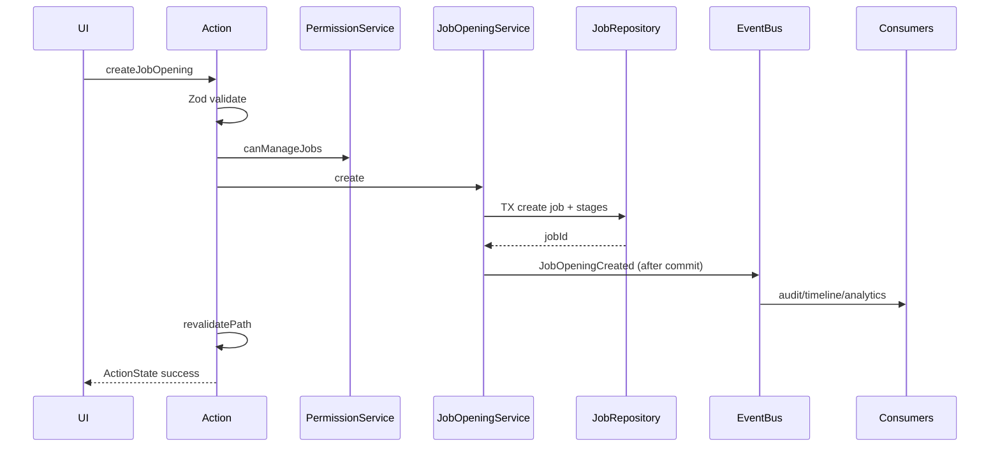
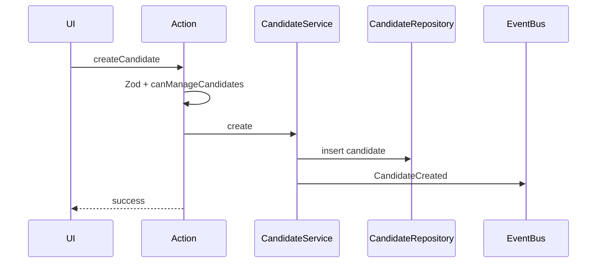
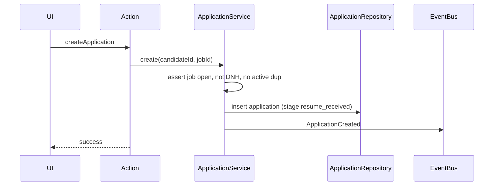
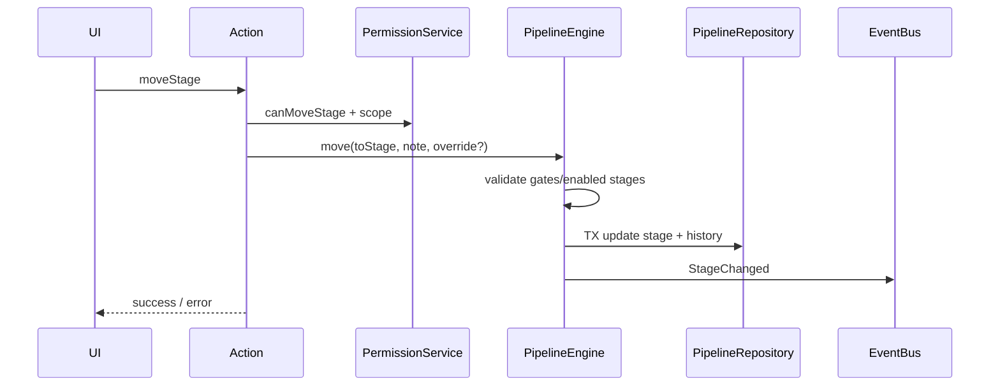
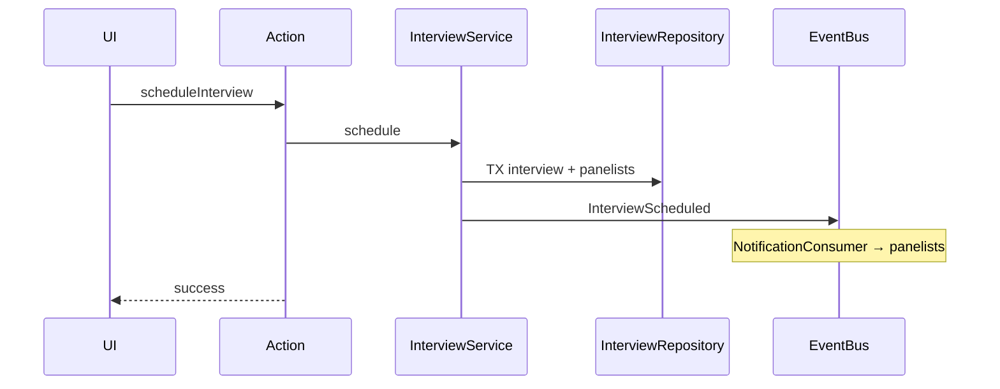
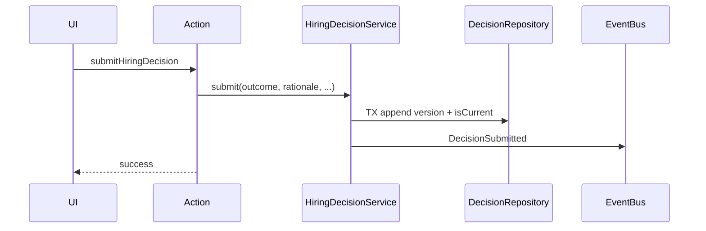
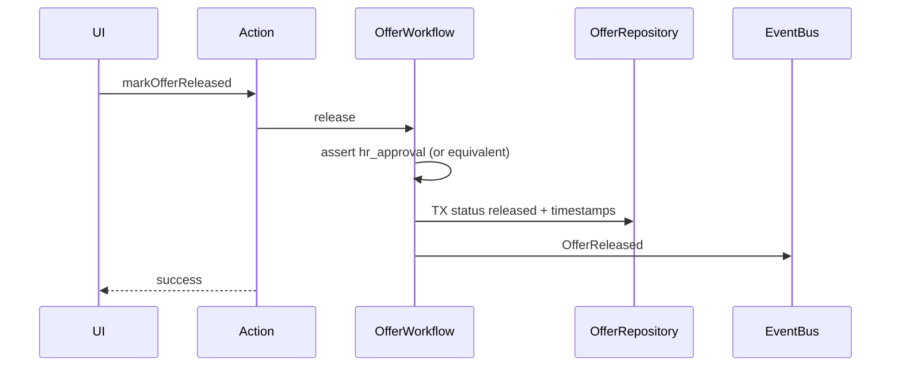
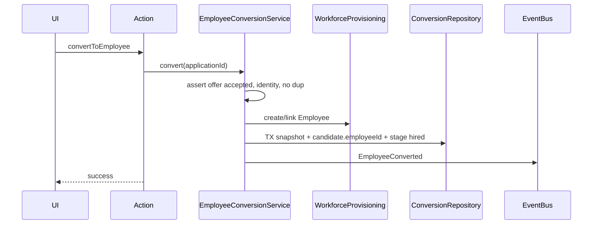

# ZEBL_HRMS — Recruitment Technical Specification

| Field | Value |
|-------|-------|
| **Document** | Engineering contract for Recruitment implementation |
| **Status** | Binding technical specification |
| **Bound to (LOCKED — do not modify)** | `RECRUITMENT_PRD.md`, `RECRUITMENT_ARCHITECTURE.md`, `RECRUITMENT_SCHEMA_DESIGN.md`, `RECRUITMENT_IMPLEMENTATION_BLUEPRINT.md` |
| **Audience** | Senior backend / full-stack engineers |
| **Out of scope for this doc** | Source code, Prisma application, migrations, UI markup, HTTP API routes |

### Normative conflict rule

If any example wording in a prompt conflicts with locked docs, **locked docs win**. Notably:

| Informal label | Canonical (schema design) |
|----------------|---------------------------|
| Job Paused | `on_hold` |
| Job Cancelled | use `closed` (no `cancelled` status) |
| Application “Applied” | stage `resume_received` + status `active` |
| Application interview bucket | concrete round stages (`hr_round`, `technical_round`, …) |
| Decision Draft/Approved | **HiringDecision** is append-only versions with `HiringDecisionOutcome`; no separate decision approval state machine |
| Offer Pending Approval | `manager_approval` or `hr_approval` |
| Offer Expired | not a V1 status — use `withdrawn` or future extension |

Return type for mutations: ZEBL `ActionState` (`error?` / `success?`).

---

# 1. Module Dependency Graph

```text
RecruitmentSettings + PipelineTemplate
        ↓
Job Opening (+ Hiring Team, Job Stages freeze)
        ↓
Candidate (+ Intake → Candidate)
        ↓
Application  (Candidate × Job Opening)
        ↓
PipelineEngine (stage on Application)
        ↓
Interviews (require Application)
        ↓
Hiring Decision (require Application; typically post-interview)
        ↓
Offer (require HiringDecision FK)
        ↓
Employee Conversion (require Accepted Offer + Snapshot)
        ↓
Dashboard / Reports (read models over all of the above)
```

### Why each dependency exists

| Edge | Reason |
|------|--------|
| Settings → Job Opening | Jobs clone stage template / SLA defaults at create; freeze per-job stages. |
| Job Opening → Application | Application cannot exist without an openable role context and hiring team for scope. |
| Candidate → Application | Application is person×job; Candidate owns profile independently of pipeline. |
| Intake → Candidate (± Application) | Intake is pre-confirm queue; must resolve person before pipeline unit exists. |
| Application → Pipeline | Stage is owned by Application (architecture invariant). |
| Application → Interview | No interview without application (schema + PRD). |
| Application → Decision | Decision is application-scoped judgment. |
| Decision → Offer | `Offer.hiringDecisionId` required; no offer without decision row. |
| Accepted Offer → Conversion | Conversion precondition; snapshot ties offer + application + candidate + employee. |
| All → Dashboard/Reports | Read-only projections; must not invent write paths. |

### Parallel / non-blocking edges

| Module | Depends on | Soft dependency |
|--------|------------|-----------------|
| Collaboration (notes/chat) | Candidate or Job | Does not block pipeline |
| AI insights | Candidate / Application | Assistive; never gates hire alone |
| Talent pool | Candidate terminal/pool status | After reject/withdraw/hire eligibility |

---

# 2. Aggregate Contracts

## 2.1 JobOpening

| Aspect | Contract |
|--------|----------|
| **Responsibilities** | Role definition; headcount **fields**; status; compensation band; frozen stage config; hiring team; job docs/notes. |
| **Owned children** | `JobOpeningStage`, `HiringTeamMember`, `JobOpeningDocument`, `JobOpeningNote` |
| **Allowed mutations** | Create/update fields; status transitions (see §3); hiring team add/remove; soft-delete docs/notes; soft-delete job. |
| **Forbidden mutations** | Rewrite in-flight `JobOpeningStage` set via casual edit (freeze invariant); create HeadcountRequest entity; hard-delete with applications (use soft-delete / close). |
| **Business invariants** | `openingsCount ≥ 1`; ≤1 `hiring_manager`; stages unique per job; department/location as strings. |
| **Lifecycle** | `draft` → `open` → (`on_hold` ↔ `open`) → `closed` \| `filled` |
| **Events** | `JobOpeningCreated`, `JobOpeningUpdated`, `JobOpeningStatusChanged`, `HiringTeamChanged`, document/note events |
| **Repository** | `job/repository` |
| **Services** | `JobOpeningService`, `HiringTeamService` |
| **TX** | Create job + copy stages (+ optional initial team) in one TX |

## 2.2 Candidate

| Aspect | Contract |
|--------|----------|
| **Responsibilities** | Canonical person; profile sections; documents/resume; compensation; availability; tags; notes/chat; talent pool entries; AI drafts; optional Employee link. |
| **Owned children** | Documents, Experience, Education, Skill, Project, Certification, Note, ChatMessage, CandidateTag, TalentPoolEntry, CandidateAiInsight |
| **Allowed mutations** | Profile CRUD; set primary resume; compensation (SA/HR); DNH; merge (via MergeService); soft-delete. |
| **Forbidden mutations** | Own pipeline stage; silent AI overwrite without Accept; second Employee link; hard-delete when applications/history exist (soft-delete / archive only). |
| **Business invariants** | Live email uniqueness (partial unique); at most one Employee; DNH blocks new applications unless SA override. |
| **Lifecycle** | `active` → `talent_pool` \| `hired` \| `do_not_hire` \| `archived` |
| **Events** | `CandidateCreated/Updated`, `CandidateMerged`, `CandidateDoNotHireSet`, `CandidateCompensationUpdated`, doc/tag/AI events |
| **Repository** | `candidate/repository` |
| **Services** | `CandidateService`, `CandidateMergeService`, `NotesService`, `ChatService`, intake/AI collaborators |
| **TX** | Profile multi-section updates optional single TX; merge always single TX |

## 2.3 Application

| Aspect | Contract |
|--------|----------|
| **Responsibilities** | Pipeline unit; current stage + status; assignments; priority; risk; aggregate score; parent of interviews/decisions/offers/conversion link. |
| **Owned children** | `ApplicationStageHistory`, `Interview` (+ panel/feedback/attachments), `HiringDecision`, `Offer`, `EmployeeConversionSnapshot` (1:1 success) |
| **Allowed mutations** | Create; assign recruiter/manager; priority; stage moves via PipelineEngine; reopen (audited); soft-delete rare. |
| **Forbidden mutations** | Exist without Candidate+Job; stage change bypassing PipelineEngine; offer without decision; hired without accepted offer (unless SA override). |
| **Business invariants** | One active app per candidate×job (partial unique); `currentStage` matches last history; dual update of `ApplicationStatus` + stage on terminal moves. |
| **Lifecycle** | See §3 Application (status + stage). |
| **Events** | `ApplicationCreated`, `ApplicationAssigned`, `ApplicationPriorityChanged`, `ApplicationReopened`, `StageChanged`, plus child aggregate events |
| **Repository** | `application/repository` (+ pipeline/interview/offer repos for children) |
| **Services** | `ApplicationService`, `PipelineEngine`, interview/decision/offer/conversion services |
| **TX** | Create app alone; stage move = app row + history; never stage+offer in same casual TX without explicit workflow |

## 2.4 IntakeItem

| Aspect | Contract |
|--------|----------|
| **Responsibilities** | Pre-candidate confirmation queue (upload/CSV/referral); duplicate review; promote to Candidate ± Application. |
| **Owned children** | None (payload/files referenced by storageKey). |
| **Allowed mutations** | Create; status transitions; attach duplicate suggestion; discard; confirm. |
| **Forbidden mutations** | Create Application before confirm path; AI auto-merge. |
| **Business invariants** | Duplicate decision required when confidence ≥ threshold; discard is terminal. |
| **Lifecycle** | `received` → `parse_pending` → `parse_ready` → (`duplicate_review`) → `confirmed` \| `discarded` |
| **Events** | `IntakeCreated`, `IntakeBatchCreated`, `IntakeDuplicateResolved`, `IntakeDiscarded`, `IntakeConfirmed` |
| **Repository** | under `candidate/repository` or dedicated intake methods therein |
| **Services** | `IntakeService`, `DuplicateCandidateEngine`, `ResumeParseService` |
| **TX** | Confirm path: intake + candidate (± application) one TX |

## 2.5 EmployeeConversionSnapshot

| Aspect | Contract |
|--------|----------|
| **Responsibilities** | Immutable exact conversion state used when creating Employee. |
| **Owned children** | None. |
| **Allowed mutations** | **Insert once** on successful conversion. |
| **Forbidden mutations** | UPDATE, soft-delete, rewrite mappedFields, delete in product paths. |
| **Business invariants** | Unique on applicationId, candidateId, offerId, employeeId; requires accepted offer (service); fieldMapVersion set. |
| **Lifecycle** | Created → forever. |
| **Events** | Emitted as part of `EmployeeConverted` (snapshot id in payload). |
| **Repository** | `conversion/repository` (insert + find only) |
| **Services** | `EmployeeConversionService` |
| **TX** | Same TX as link + Hired stage (+ Employee create when possible) |

## 2.6 RecruitmentSettings

| Aspect | Contract |
|--------|----------|
| **Responsibilities** | Org singleton: default template, SLA JSON, AI toggle, offer/decision policies, HM comp visibility, skip-HM policy. |
| **Owned children** | Logical association to `RecruitmentPipelineTemplate` (not exclusive ownership of all templates). |
| **Allowed mutations** | Update singleton; template CRUD (related settings service). |
| **Forbidden mutations** | Mutating frozen JobOpeningStage rows by changing templates. |
| **Business invariants** | Single row `id = "default"`. |
| **Lifecycle** | Seeded at migrate; updated in place. |
| **Events** | `RecruitmentSettingsUpdated`, `PipelineTemplateChanged` |
| **Repository** | via `services/settings-service` persistence |
| **Services** | `RecruitmentSettingsService` |
| **TX** | Single-row update |

---

# 3. State Machines

## 3.1 Job Opening (`JobOpeningStatus`)

```text
draft → open → on_hold ⇄ open → closed
                open → filled
                draft → closed (abandon)
```

| Transition | Who | Validation | Events | Notify | Audit | Rollback |
|------------|-----|------------|--------|--------|-------|----------|
| draft→open | SA/HR | title required; stages present; openingsCount≥1 | StatusChanged | hiring team optional | yes | N/A (forward) |
| open→on_hold | SA/HR | reason recommended | StatusChanged | team | yes | reverse open |
| on_hold→open | SA/HR | — | StatusChanged | team | yes | — |
| open→filled | SA/HR | preferably hire count met (warn if not) | StatusChanged | team | yes | SA reopen to open (audited) |
| open/on_hold→closed | SA/HR | reason | StatusChanged | team | yes | SA reopen audited |
| draft→closed | SA/HR | — | StatusChanged | — | yes | — |

**Rollback behavior:** No automatic rollback. Corrections are new audited transitions (e.g. closed→open as explicit reopen policy for SA/HR).

---

## 3.2 Application — dual model

### A. `ApplicationStatus` (coarse)

`active` | `on_hold` | `hired` | `rejected` | `withdrawn`

### B. `RecruitmentPipelineStage` (fine) on same row

Progression (enabled stages only):

```text
resume_received → screening → assessment? → hr_round? → technical_round? →
team_lead_round? → manager_round → client_round? → reference_check? →
decision → offer → hired
```

Side states: `on_hold`, `rejected`, `withdrawn` (also mirrored in ApplicationStatus).

| Transition class | Who | Validation | Events | Notify | Audit | Rollback |
|------------------|-----|------------|--------|--------|-------|----------|
| Forward stage | SA/HR; HM if allowed | stage enabled on job; note if skip/back | StageChanged | recruiter/HM | yes | only via explicit move back if not hired |
| → decision | SA/HR/HM policy | interviews policy soft in V1 | StageChanged | HM | yes | — |
| → offer stage | SA/HR | current Decision ∈ {strong_hire,hire} or SA override | StageChanged | — | yes | — |
| → hired stage | SA/HR | Offer accepted or SA override | StageChanged | — | yes | **forbidden** reverse after hire except SA break-glass |
| → rejected/withdrawn | SA/HR | reason required | StageChanged | team | yes | reopen action only |
| → on_hold / resume | SA/HR; HM request | reason | StageChanged | — | yes | resume to prior/screening |

**Cannot move backwards after hire** (normative rule §8).

---

## 3.3 Offer (`OfferStatus`)

```text
draft → manager_approval → hr_approval → released → accepted
                                      ↘ declined | withdrawn
draft → hr_approval          (if no HM — skip)
any approval → draft         (on rejection of approval)
released → withdrawn
```

| Transition | Who | Validation | Events | Notify | Audit | Rollback |
|------------|-----|------------|--------|--------|-------|----------|
| create draft | SA/HR | decision FK; outcome hire-class | OfferCreated | — | yes | delete draft only if never submitted (soft policy) |
| submit | SA/HR | package complete | OfferApprovalRequested | HM or HR | yes | — |
| skip to hr_approval | system on submit | no HM on job | (flag on offer) + ApprovalRequested | HR | yes | — |
| manager approve | HM/SA | status manager_approval | OfferManagerApproved | HR | yes | — |
| HR approve | HR/SA | status hr_approval | OfferHrApproved | recruiter | yes | — |
| reject approval | step actor | comment | OfferApprovalRejected | recruiter | yes | back to draft |
| release | SA/HR | hr approved | **OfferReleased** | HM/recruiter | yes | cannot un-release; withdraw instead |
| accept | SA/HR | released | OfferAccepted | HM | yes | — |
| decline | SA/HR | released | OfferDeclined | HM | yes | app may return decision (separate pipeline action) |
| withdraw | SA/HR | not accepted | OfferWithdrawn | HM | yes | — |

**Expired:** not in V1 enum. Operationally withdraw or leave released until HR acts.

---

## 3.4 Hiring Decision (versioned — not Draft/Approved machine)

There is **no** multi-state decision approval workflow in V1.

| Operation | Who | Validation | Events | Notify | Audit | Rollback |
|-----------|-----|------------|--------|--------|-------|----------|
| submit (v1) | HM assigned / HR / SA | required rationale/strengths; concerns if reject/hold/borderline | DecisionSubmitted | recruiter | yes | N/A |
| revise (vN) | same | reason; flip `isCurrent` | DecisionSubmitted | optional | yes | prior versions retained immutable |

Outcomes: `strong_hire` | `hire` | `borderline` | `hold` | `reject`.

TL does **not** submit final decision (feedback only).

---

# 4. Repository Contracts

All methods are contracts only. `tx?` = optional transaction client.

## JobRepository

- `create(data, stages[], tx?)`
- `update(id, patch, tx?)`
- `changeStatus(id, status, meta, tx?)`
- `softDelete(id, tx?)`
- `findById(id)`
- `list(scope, filters, pagination, sort)`
- `search(scope, query, pagination)`
- `addStageConfig(jobId, stages[], tx?)` (create-time only)
- `listStages(jobId)`
- `addDocument` / `softDeleteDocument` / `listDocuments`
- `addNote` / `updateNote` / `softDeleteNote` / `listNotes`

**TX:** `create` + stages atomic.

## HiringTeamRepository

- `addMember(jobId, employeeId, role, tx?)`
- `removeMember(id, tx?)`
- `listByJob(jobId)`
- `listJobIdsForEmployee(employeeId)` — ScopeEngine
- `countHiringManagers(jobId)`

**TX:** with job create optional; unique constraints enforce one HM.

## CandidateRepository

- `create` / `update` / `softDelete` / `setStatus`
- `findById` / `findByEmail` / `findByPhone`
- `list` / `search` (scope)
- `setEmployeeLink(candidateId, employeeId, tx?)`
- `markMerged(loserId, survivorId, tx?)`
- Profile: `upsertExperience|Education|Skill|Project|Certification`, `replaceSection`
- Documents: `addDocument`, `setPrimaryResume`, `softDeleteDocument`
- Tags: `setTags`
- TalentPool: `addEntry`, `closeEntry`
- AI: `createInsight`, `updateInsightStatus`
- Intake: `createIntake`, `updateIntake`, `findIntake`, `listIntake`

**TX:** merge and confirm-intake require TX.

## ApplicationRepository

- `create` / `update` / `softDelete`
- `findById` / `findByCandidate` / `findByJob`
- `findActiveByCandidateAndJob`
- `list` / `search` (scope)
- `assignRecruiter` / `assignManager` / `setPriority`
- `setStatus` / `setAggregateScore`
- `updateStageFields(id, stage, stageEnteredAt, status?, tx?)` — called by Pipeline repository/engine

**TX:** create alone; stage via pipeline repo.

## PipelineRepository

- `appendStageHistory(entry, tx?)`
- `changeStage(applicationId, from, to, meta, tx?)` — updates app + history
- `listHistory(applicationId)`

**TX:** always with app stage update.

## InterviewRepository

- `create` / `update` / `softDelete`
- `findById` / `listByApplication` / `listByScheduleRange` (scope)
- `replacePanelists(interviewId, employeeIds[], tx?)`
- `addAttachment` / `softDeleteAttachment`
- Feedback: `upsertFeedback`, `listFeedback`, `findFeedback`

**TX:** schedule + panelists atomic.

## DecisionRepository

- `appendDecision(data, tx?)` — sets previous `isCurrent=false`
- `findCurrent(applicationId)`
- `listByApplication(applicationId)`

**TX:** append + flip current.

## OfferRepository

- `create` / `update`
- `findById` / `findActiveByApplication` / `list` (scope)
- `changeStatus(id, status, timestamps, tx?)`
- `addRevision(offerId, snapshot, tx?)`

**TX:** status change + revision together when package changes.

## ConversionRepository

- `insertSnapshot(data, tx?)` — insert only
- `findByApplicationId` / `findByCandidateId` / `findByEmployeeId`

**TX:** with conversion orchestration.

## SettingsRepository

- `getSettings()` / `updateSettings(patch, tx?)`
- `createTemplate` / `updateTemplate` / `listTemplates` / `getTemplateWithStages`

## TimelineProjectionRepository (consumer-owned)

- `append(eventProjection)`
- `listByEntity` / `listByCandidate` / `listByApplication`

## MetricSnapshotRepository (consumer/worker)

- `upsertSnapshot` / `querySnapshots`

---

# 5. Service Contracts

Format: **Input → Output**; validation; permissions; repos; events; failures; idempotency.

### JobOpeningService.create
- **In:** actor, job fields, templateId?  
- **Out:** `{ jobId }`  
- **Val:** Zod + openingsCount + template exists  
- **Perm:** SA/HR  
- **Repos:** Job, HiringTeam?, Settings(template)  
- **Events:** JobOpeningCreated  
- **Fail:** unauthorized, invalid template  
- **Idempotency:** none (client retry may duplicate — optional idempotency key future)

### JobOpeningService.changeStatus
- **In:** actor, jobId, toStatus, reason?  
- **Out:** void  
- **Val:** legal graph  
- **Perm:** SA/HR  
- **Events:** JobOpeningStatusChanged  
- **Fail:** illegal transition  
- **Idempotency:** no-op if already in status

### HiringTeamService.add/remove
- **In:** actor, jobId, employeeId, role  
- **Out:** void  
- **Val:** employee exists; HM cardinality  
- **Perm:** SA/HR  
- **Events:** HiringTeamChanged  
- **Fail:** duplicate, second HM  
- **Idempotency:** add unique constraint

### CandidateService.create / updateProfile / updateCompensation / setDoNotHire / documents / tags
- **Perm:** SA/HR (comp edit SA/HR; HM view only)  
- **Events:** Candidate* / document events  
- **Fail:** duplicate email, unauthorized comp  
- **Idempotency:** update by id

### CandidateMergeService.merge
- **In:** actor, survivorId, loserId  
- **Out:** survivorId  
- **Val:** both exist; not same; loser not converted alone without policy  
- **Events:** CandidateMerged  
- **Fail:** both have distinct employees  
- **Idempotency:** loser already merged → success

### IntakeService.confirm
- **In:** intakeId, merge|create choice, jobId?  
- **Out:** candidateId, applicationId?  
- **Events:** IntakeConfirmed (+ ApplicationCreated/CandidateCreated)  
- **Fail:** unresolved duplicate  
- **Idempotency:** already confirmed returns existing ids

### ApplicationService.create
- **In:** actor, candidateId, jobId  
- **Out:** applicationId  
- **Val:** job open; not DNH; no active dup  
- **Events:** ApplicationCreated  
- **Fail:** closed job, DNH, dup  
- **Idempotency:** return existing active if policy allow-dup false

### PipelineEngine.move / hold / reject / withdraw / bulkMove
- **In:** actor, applicationId, toStage, note?, override?  
- **Out:** void  
- **Val:** enabled stages; gates for offer/hired; reason on terminal  
- **Perm:** SA/HR; HM limited stages  
- **Repos:** Pipeline + Application  
- **Events:** StageChanged  
- **Fail:** illegal, concurrent stage mismatch  
- **Idempotency:** same stage no-op; optimistic check on `currentStage`

### InterviewService.schedule / reschedule / cancel / complete / noShow
- **Events:** InterviewScheduled (etc.)  
- **Val:** ≥1 panelist  
- **Fail:** missing app  
- **Idempotency:** schedule creates new row each time (intentional)

### InterviewFeedbackService.submit
- **Val:** panelist membership  
- **Events:** InterviewFeedbackSubmitted  
- **Idempotency:** unique (interviewId, authorEmployeeId)

### HiringDecisionService.submit / revise
- **Events:** DecisionSubmitted  
- **Fail:** TL attempt; missing fields  
- **Idempotency:** revise always new version

### OfferWorkflow.* 
- **Val:** decision required; state machine; skip HM  
- **Events:** Offer* including OfferReleased  
- **Fail:** wrong actor step; missing decision  
- **Idempotency:** status no-op if already

### EmployeeConversionService.convert
- **In:** actor, applicationId, overrides?  
- **Out:** `{ employeeId, snapshotId }`  
- **Val:** offer accepted; identity fields; no conflicting employee  
- **Perm:** SA/HR  
- **Repos:** Conversion + Application + Candidate; workforce Employee APIs  
- **Events:** EmployeeConverted  
- **Fail:** dup employee, provisioning error, missing snapshot write  
- **Idempotency:** existing snapshot for application → return existing

### AiAssist / ResumeParse + AiPolicyGuard
- **Fail:** policy deny on forbidden ops  
- **Events:** Ai*  
- **Idempotency:** accept twice → no-op if already accepted

### RecruitmentSettingsService.update
- **Perm:** SA; HR limited fields  
- **Events:** RecruitmentSettingsUpdated  
- **Idempotency:** patch apply

### RecruitmentReportQueryService / dashboard queries
- **Out:** DTOs  
- **Perm:** ScopeEngine mandatory  
- **Events:** none  
- **Fail:** empty scope → empty data (not error)

---

# 6. Query Layer

All list/detail queries: **ScopeEngine.resolve → apply scope → filters → sort → paginate**. Compensation fields omitted unless `canViewCompensation`.

| Surface | Filters | Search | Sort | Pagination | Cache |
|---------|---------|--------|------|------------|-------|
| **Dashboard widgets** | jobId?, dateRange | — | fixed | feed ≤50 | `cache()` scope; `revalidatePath` home |
| **Jobs list** | status, department, owner | title/code | createdAt, status | page/cursor size≤50 | RSC + revalidate jobs |
| **Job detail** | — | — | — | tabs lazy | revalidate job id |
| **Candidates list** | status, source, tags, recruiter | name, email, phone | createdAt, name | ≤50 | same |
| **Candidate detail** | — | — | — | section lazy queries | revalidate candidate |
| **Talent pool** | reason, enteredAt | name/email | enteredAt | ≤50 | HR/SA only |
| **Applications list** | job, stage, status, priority, recruiter, manager | candidate name | stageEnteredAt, priority | ≤50 | critical indexes |
| **Application detail** | — | — | — | — | revalidate app |
| **Pipeline board** | jobId required | — | stage columns | cards capped / virtualize later | no full interview join |
| **Interviews list** | date, status, job | candidate | scheduledStart | ≤50 | today widget |
| **Offers list** | status, job | candidate | updatedAt | ≤50 | strip comp if unauthorized |
| **Reports** | period, job, recruiter, dept | — | metric-defined | report rows | prefer MetricSnapshot |
| **AI queue** | status pending | — | createdAt | ≤50 | HR/SA |
| **Timeline embed** | entityType/id | — | createdAt desc | keyset | scoped by parent visibility |
| **Intake queue** | status | fileName | createdAt | ≤50 | HR/SA |

**Scope filtering:** unrestricted SA/HR; else `jobOpeningId IN scope.jobIds` and/or application/candidate id sets from hiring team + panelist + assignments.

---

# 7. Permission Matrix (action-level)

| Action | Required role/capability | ScopeEngine | Ownership / resource check | PermissionService |
|--------|--------------------------|-------------|----------------------------|-------------------|
| Create Job | SA/HR | unrestricted | — | `canManageJobs` |
| Update Job | SA/HR | — | job exists | same |
| Close / Hold / Fill Job | SA/HR | — | job | same |
| Assign Recruiter (app or job owner) | SA/HR | — | app/job | `canAssignRecruiter` |
| Assign Hiring Manager | SA/HR | — | job team / app | `canManageHiringTeam` |
| View Job (HM/TL) | capability | **yes** | job in scope | `canViewJob` |
| Create Candidate | SA/HR | — | — | `canManageCandidates` |
| Archive Candidate (soft) | SA/HR | — | no blocking policy | same |
| Delete Candidate | SA/HR | — | **forbidden if history** — soft only | same |
| Merge Candidate | SA/HR | — | — | same |
| Update Compensation | SA/HR | — | — | `canEditCompensation` |
| View Compensation | SA/HR/HM | yes for HM | assigned jobs | `canViewCompensation` |
| Create Application | SA/HR | — | candidate+job | `canCreateApplication` |
| Move Stage | SA/HR; HM limited | yes for HM | app in scope | `canMoveStage` |
| Schedule Interview | SA/HR | — | app | `canScheduleInterview` |
| Submit Feedback | panelist/HR/SA | yes | panelist row | `canSubmitFeedback` |
| Submit Decision | HM/HR/SA | yes HM | assigned HM | `canSubmitDecision` |
| Approve Decision | — | — | **N/A V1** (no decision approval SM) | — |
| Create/Update Offer | SA/HR | — | decision gate | `canManageOffer` |
| Manager Approve Offer | HM/SA | yes | HM on job | `canApproveOfferManager` |
| HR Approve Offer | HR/SA | — | — | `canApproveOfferHr` |
| Release Offer | SA/HR | — | hr approved | `canReleaseOffer` |
| Convert Employee | SA/HR | — | accepted offer | `canConvertEmployee` |
| Export Reports | SA/HR; HM scoped | **yes** | — | `canViewReports` |
| Settings update | SA; HR limited | — | — | `canManageRecruitmentSettings` |
| AI Accept/Dismiss | SA/HR | — | — | `canManageAiDrafts` |

Unassigned employees: ScopeEngine empty → no data; access gate denies recruitment nav.

---

# 8. Validation Rules

### Hard rules (must enforce in services + DB where possible)

1. Cannot create Application for `do_not_hire` candidate without SA override.  
2. Cannot create Application on non-`open` job (except SA).  
3. Cannot have two `active` applications for same candidate×job.  
4. Cannot move stage except via PipelineEngine.  
5. Cannot enter `offer` stage / create Offer without current Decision ∈ {`strong_hire`,`hire`} unless SA override.  
6. Cannot set Application/`hired` stage without Offer `accepted` unless SA override.  
7. Cannot create Offer without `hiringDecisionId`.  
8. Cannot convert without Offer `accepted` (and snapshot write).  
9. Cannot convert twice for same application (snapshot unique).  
10. Cannot move backwards from `hired` except SA break-glass with reason.  
11. Cannot hard-delete Candidate with applications/history — soft-delete / archive only.  
12. Cannot archive Candidate while they have `active` applications — close apps first (or block).  
13. Cannot add second `hiring_manager` to a job.  
14. Cannot Accept AI draft into forbidden operations (stage/reject/convert/approve/email).  
15. Cannot release Offer before HR approval (after manager step or skip).  
16. Interview requires ≥1 panelist.  
17. Feedback only from panelist (or HR/SA).  
18. TL cannot submit HiringDecision.  
19. Team Lead cannot view compensation.  
20. Template change does not rewrite existing JobOpeningStage rows.  
21. EmployeeConversionSnapshot is insert-only.  
22. Manager approval skipped iff zero HM at submit time.  
23. Bulk stage move: HR/SA only; same target; max batch size policy.  
24. Private/HR-only notes never returned to unauthorized queries.

---

# 9. Event Flow

### Bus policy

- Publish **after commit**.  
- In-process fan-out V1; per-consumer try/catch.  
- Idempotency key: `eventType + aggregateId + causationId/historyId`.  
- Ordering: serialize stage events per `applicationId` (TX + stage precondition).  
- Retry: failed consumer → log + optional `IntegrationJob` replay; no inline infinite retry.  
- Business services never call audit/notify/timeline directly.

| Event | Publisher | Audit | Timeline | Notify | Analytics | Order key |
|-------|-----------|-------|----------|--------|-----------|-----------|
| ApplicationCreated | ApplicationService | Y | Y | Y | Y | applicationId |
| StageChanged | PipelineEngine | Y | Y | Y | Y | applicationId |
| InterviewScheduled (+ siblings) | InterviewService | Y | Y | Y | Y | interviewId |
| DecisionSubmitted | DecisionService | Y | Y | Y | Y | applicationId |
| OfferReleased (+ offer siblings) | OfferWorkflow | Y | Y | Y | Y | offerId |
| CandidateMerged | MergeService | Y | Y | Y | Y | survivorId |
| EmployeeConverted | ConversionService | Y | Y | Y | Y | applicationId |
| JobOpening* / HiringTeamChanged | Job services | Y | Y | limited | Y | jobId |
| Intake* | IntakeService | Y | Y | limited | optional | intakeId |
| Note*/Chat* | Collaboration | notes Y | Y | mentions | — | candidateId/jobId |
| Ai* | AI services | Y | Y | parse-ready | optional | candidateId |
| Settings* | Settings | Y | optional | — | — | global |

---

# 10. Sequence Diagrams

### Create Job



### Create Candidate



### Create Application



### Move Pipeline



### Schedule Interview



### Submit Decision (V1 — no separate approve step)



### Release Offer



### Convert Employee



---

# 11. Error Catalog

Domain errors map to `ActionState.error` (ZEBL has no HTTP for server actions). API-equivalent codes documented for future/admin tooling.

| Code | Message (canonical) | HTTP equiv | Recovery |
|------|---------------------|------------|----------|
| `REC_UNAUTHORIZED` | Unauthorized | 403 | Re-auth / wrong persona |
| `REC_FORBIDDEN_SCOPE` | Outside recruitment scope | 403 | Assign to hiring team |
| `REC_NOT_FOUND` | Resource not found | 404 | Refresh list |
| `REC_VALIDATION` | Invalid input | 400 | Fix fields |
| `REC_JOB_ILLEGAL_STATUS` | Illegal job status transition | 409 | Choose legal status |
| `REC_JOB_HM_EXISTS` | Hiring manager already assigned | 409 | Remove existing HM |
| `REC_CANDIDATE_DUP_EMAIL` | Email already in use | 409 | Merge or use other email |
| `REC_CANDIDATE_DNH` | Candidate marked do-not-hire | 409 | SA override or abort |
| `REC_CANDIDATE_HAS_HISTORY` | Cannot hard-delete candidate with history | 409 | Soft-delete/archive |
| `REC_CANDIDATE_ACTIVE_APPS` | Cannot archive with active applications | 409 | Close applications first |
| `REC_APP_DUP_ACTIVE` | Active application already exists | 409 | Open existing |
| `REC_APP_JOB_NOT_OPEN` | Job opening not open | 409 | Open job |
| `REC_STAGE_ILLEGAL` | Illegal stage transition | 409 | Choose allowed stage |
| `REC_STAGE_GATE_DECISION` | Hire-class decision required | 409 | Submit decision |
| `REC_STAGE_GATE_OFFER` | Accepted offer required to hire | 409 | Accept offer |
| `REC_STAGE_CONFLICT` | Stage changed by another user | 409 | Reload and retry |
| `REC_INTERVIEW_NO_PANEL` | At least one panelist required | 400 | Add panelist |
| `REC_FEEDBACK_NOT_PANELIST` | Not an interview panelist | 403 | — |
| `REC_DECISION_FORBIDDEN` | Cannot submit decision | 403 | HM/HR only |
| `REC_OFFER_NO_DECISION` | Offer requires hiring decision | 409 | Submit decision |
| `REC_OFFER_ILLEGAL_STATUS` | Illegal offer transition | 409 | — |
| `REC_OFFER_WRONG_APPROVER` | Not the approver for this step | 403 | — |
| `REC_CONVERT_PRECONDITION` | Conversion preconditions failed | 409 | Accept offer / fix identity |
| `REC_CONVERT_DUP_EMPLOYEE` | Employee already exists for identity | 409 | Link-existing flow / resolve |
| `REC_CONVERT_IDEMPOTENT` | Already converted | 200-equiv success | Return existing ids |
| `REC_SNAPSHOT_IMMUTABLE` | Conversion snapshot cannot be modified | 409 | — |
| `REC_AI_POLICY` | AI action not allowed | 403 | Human path |
| `REC_INTAKE_DUP_PENDING` | Duplicate review required | 409 | Resolve duplicate |
| `REC_COMP_FORBIDDEN` | Compensation access denied | 403 | — |
| `REC_INTERNAL` | Unexpected error | 500 | Retry / support |

---

# 12. Performance Targets

| Metric | Target (V1) |
|--------|-------------|
| Jobs/Candidates/Applications list | ≤ 3–5 queries; p95 &lt; 300ms at 50k apps (warm) |
| Pipeline board (single job) | 1 primary applications query + optional counts; p95 &lt; 400ms |
| Dashboard home | ≤ 8 widget queries or 1 snapshot + 3 live; p95 &lt; 500ms |
| Candidate detail cold | shell 1 query; tabs lazy 1 each |
| ScopeEngine.resolve | 1–2 queries; React `cache()` per request |
| Pagination | default 25, max 50 |
| Indexes | schema design §6 mandatory |
| N+1 prevention | no per-row relations in lists; use `_count` or denormalized summary fields |
| Caching | request `cache()` for scope/settings; `revalidatePath` after writes; snapshots for reports |
| Dashboard aggregation | MetricSnapshot for funnel/velocity when volume high |

---

# 13. Testing Matrix

| Area | Must cover |
|------|------------|
| **Unit** | Pipeline gates; Offer skip-HM; Decision versioning; AiPolicyGuard; ScopeEngine matrices; Zod schemas |
| **Integration** | Service+repo+DB; after-commit events → audit/timeline rows; merge; intake confirm; conversion idempotency |
| **Permission** | Every §7 action; compensation omit; TL cannot decide; HM scoped lists |
| **Migration** | Partial uniques; seed settings; enum values |
| **Edge** | DNH, dup app, closed job, no panelist, offer without decision, archive with active apps |
| **Concurrency** | Two stage moves; double convert; double offer accept |
| **Race** | StageChanged ordering; feedback unique; HM assign during offer submit skip evaluation |

---

# 14. Implementation Risks

| Risk | Mitigation |
|------|------------|
| `/admin` access for HM/TL employees | Phase 1 access gate + ScopeEngine; single route tree only |
| Dual Application status vs stage drift | PipelineEngine updates both atomically |
| Event consumer failure after commit | Isolated catch + replay job; monitor |
| Conversion cross-module TX | Prefer one TX; else saga with alerts |
| Compensation leakage via timeline metadata | Scrub in TimelineConsumer |
| Scope filter copy-paste bugs | Lint/review rule; shared query helper requiring scope arg |
| Partial indexes omitted | Migration checklist gate |
| AI treated as authority | PolicyGuard + Accept UX + tests |
| Large dashboard live aggregates | Snapshots + bounded date ranges |
| Offer “Released” mistaken for email sent | UI copy + PRD; no email enqueue to candidates |

---

# 15. Production Readiness Checklist

### Feature flags
- [ ] `recruitment_module_enabled` (nav/shell)  
- [ ] `recruitment_offers_enabled`  
- [ ] `recruitment_conversion_enabled`  
- [ ] Flags default off in prod until pilot  

### Migration
- [ ] Schema matches schema design  
- [ ] Partial unique indexes applied  
- [ ] NotificationType extended  
- [ ] Settings + default pipeline template seeded  
- [ ] Rollback plan: flag off; forward-only migrations  

### Security
- [ ] PermissionService on all actions  
- [ ] ScopeEngine on all queries  
- [ ] Compensation select omission tested  
- [ ] Document download authz  
- [ ] No candidate outbound email paths  

### Observability
- [ ] Structured logs with actor + aggregate ids  
- [ ] Consumer error metrics  
- [ ] Conversion failure alerts  
- [ ] Audit actions `recruitment.*` visible in admin audit UI  

### Performance
- [ ] Explain plans on board + list queries with seed volume  
- [ ] Pagination caps enforced  
- [ ] N+1 checks on candidate/application lists  

### Testing
- [ ] Unit/integration/permission suites green  
- [ ] E2E happy path job→convert on staging  
- [ ] Concurrency tests for stage + convert  

### Accessibility / UX shell
- [ ] WorkspacePageHeader patterns  
- [ ] Empty/loading/error states  
- [ ] Keyboard-accessible dialogs/sheets  

### Eventing
- [ ] After-commit publish verified  
- [ ] Audit/timeline/notification consumers registered  
- [ ] Idempotency keys on StageChanged / EmployeeConverted  

### Rollout
- [ ] Staging pilot with HR  
- [ ] Conversion dry-run  
- [ ] Prod flag on for SA → HR → HM assignments  
- [ ] Runbook for rollback and duplicate employee resolution  

---

**End of technical specification.**  
This document is the engineering contract for implementation. Locked PRD, Architecture, Schema Design, and Implementation Blueprint remain authoritative for product and structural decisions.
